#AWS RDS demo project

Simple project with 3 options api (findAll, findByName, save) for some Book model. It's using postgres deployer on AWS RDS as db.

Short guide for creating rds instance:
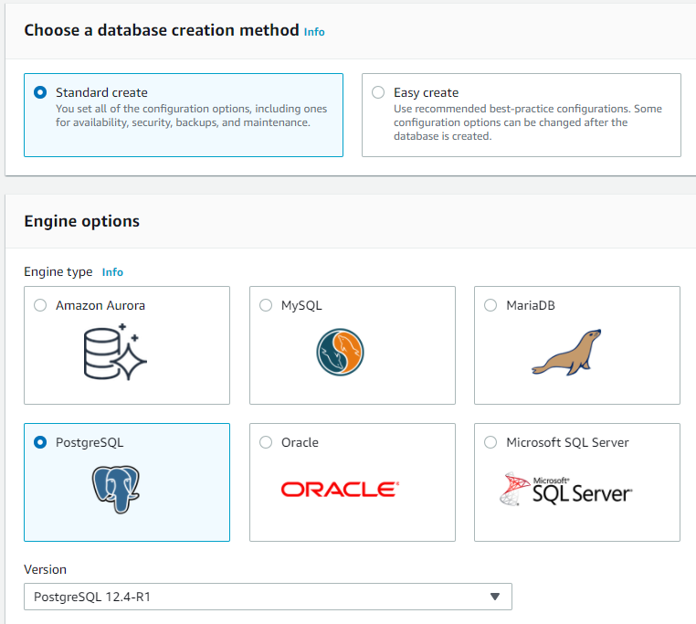
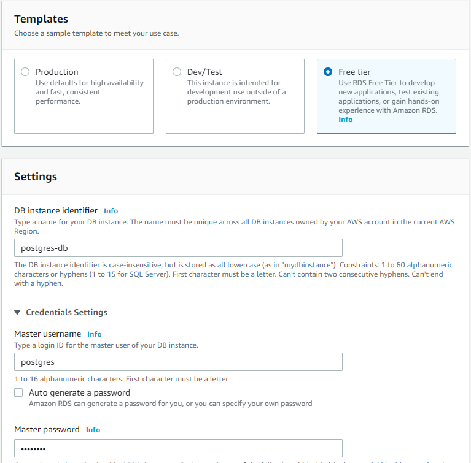
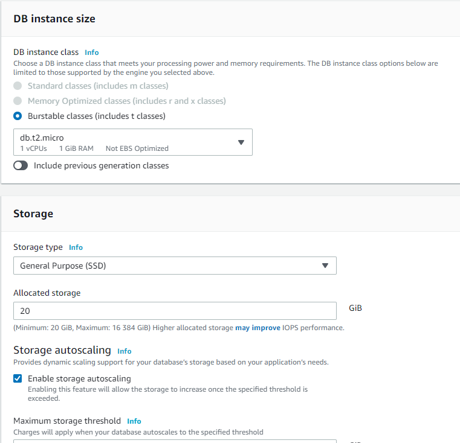
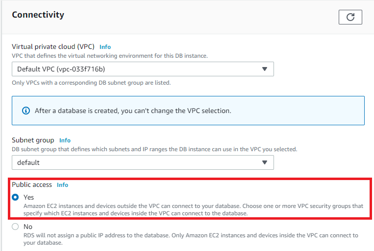
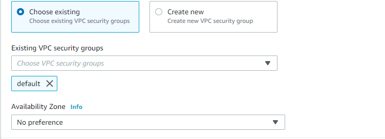
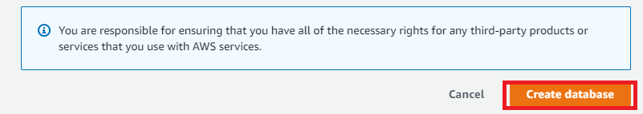

after creating we should open db page and configure accesses:
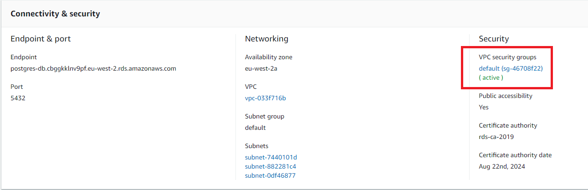
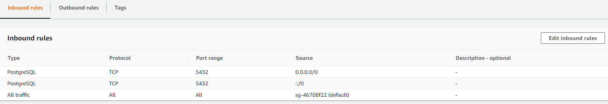

##Elastic beanstalk
Another way to create rds instance and bind it with application - elastic beanstalk:
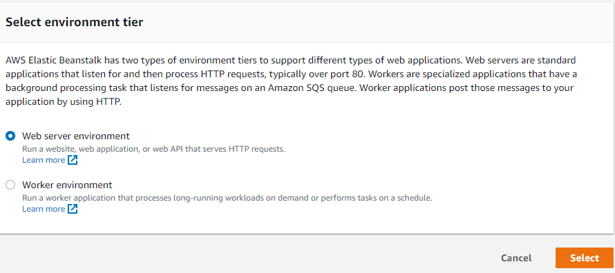
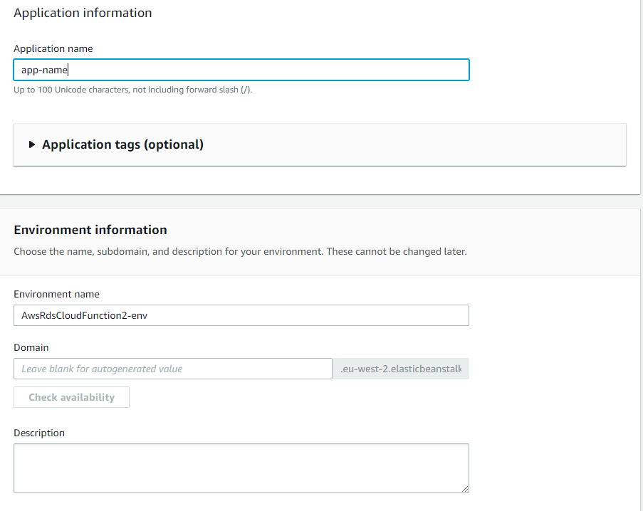
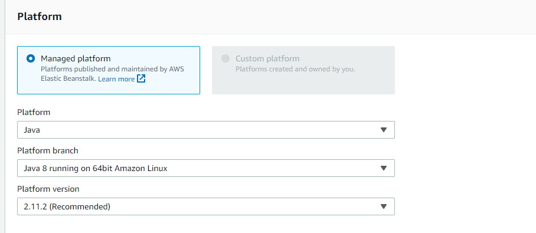
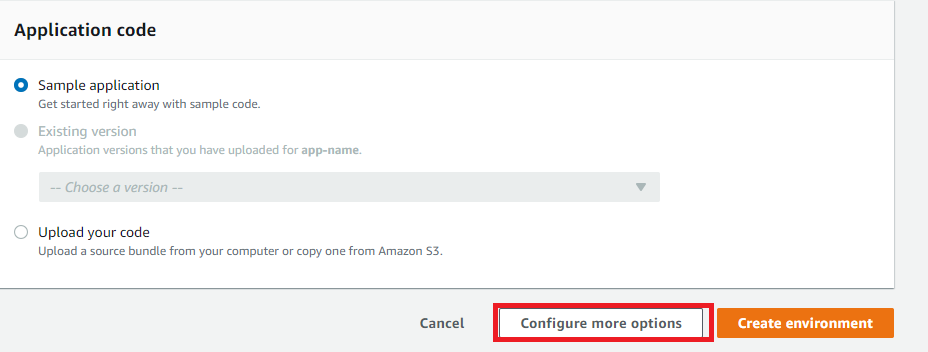
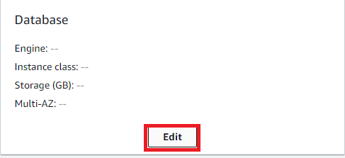
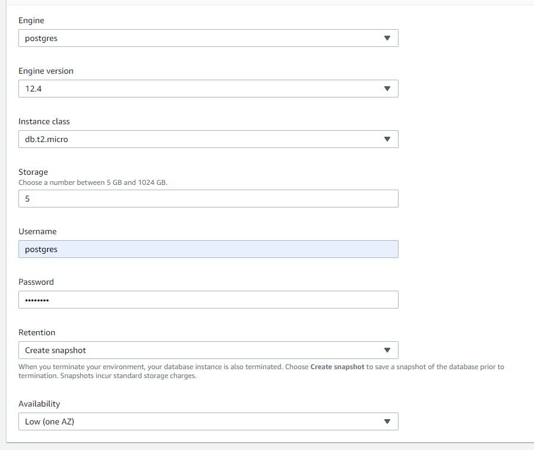

Example of two db created by different ways (pure rds and beanstalk):
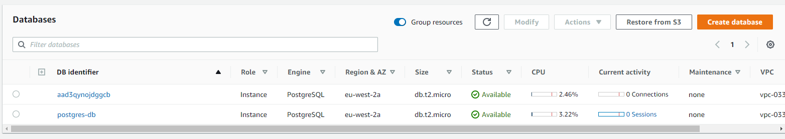